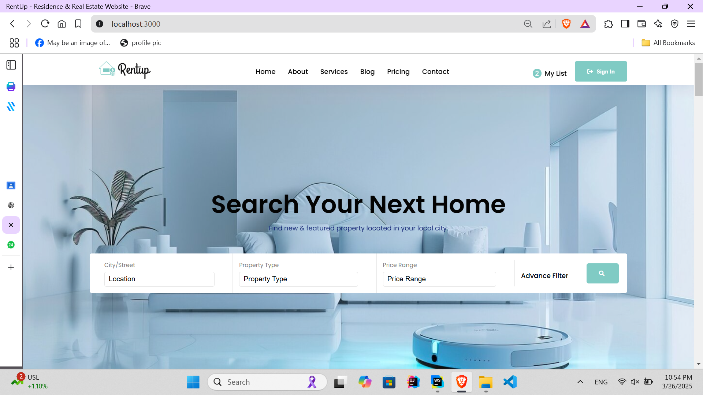
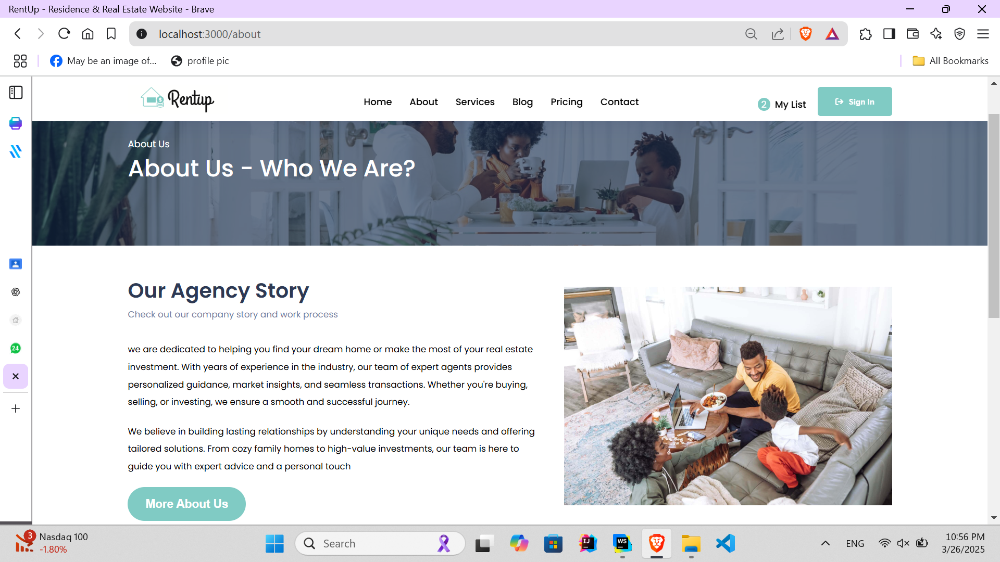
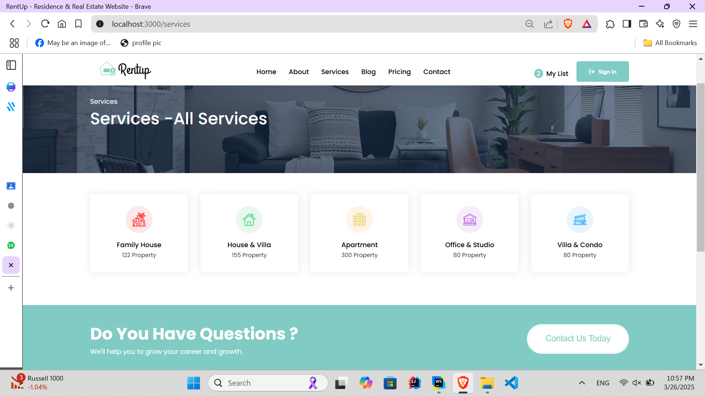
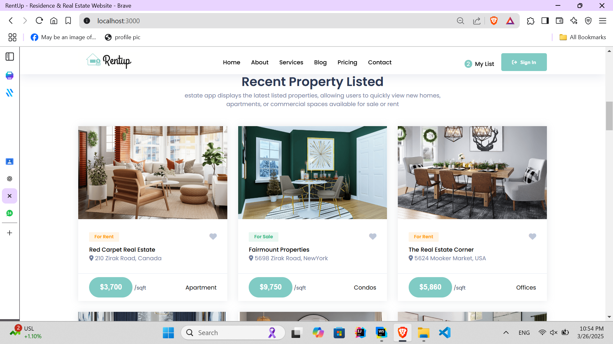
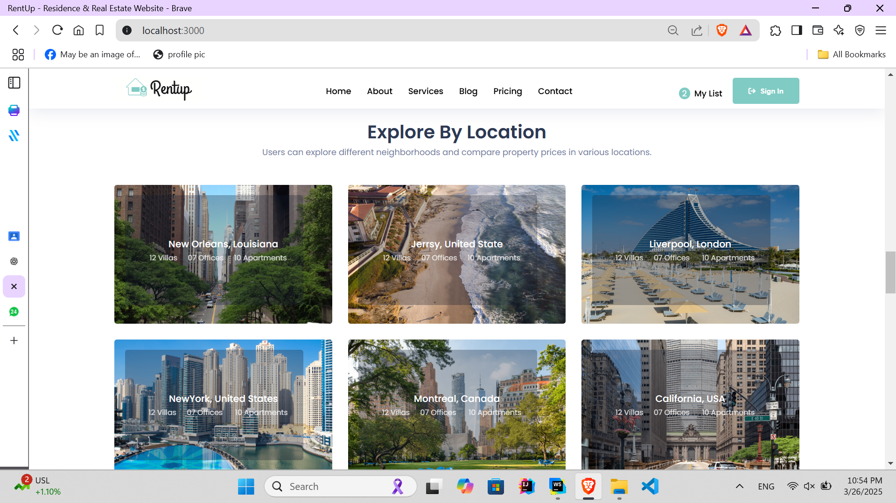
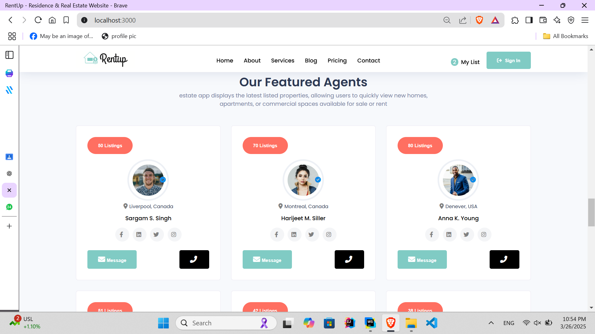

# 🏡 RentUp - Real Estate Website

RentUp is a modern real estate web app frontend built using **React**. This project was developed as a practice exercise to improve **React component hierarchy, state management, and routing**.

## 🚀 Features
✅ **Home** – Engaging landing page with a sleek UI  
✅ **About** – Information about the company and mission  
✅ **Services** – Details on real estate services offered  
✅ **Blog** – Latest industry insights and articles  
✅ **Pricing** – Transparent pricing details for services  
✅ **Contact** – A responsive form for inquiries

## 🛠 Tech Stack
- **React** – Component-based UI development
- **React Router** – Page navigation

### Installation

1. Clone the repository:

   ```bash
   git clone https://github.com/sachiniwathudura/RentUp-Real-Estate-Website

   ```
2. Install dependencies:
 ```bash
    npm install
```
3.To run the development server:
```bash
   npm start
```

## 📸 Screenshots
 <div style="display: flex; flex-wrap: wrap; justify-content: center; gap: 16px; text-align: center;">
  <div style="flex: 1 1 calc(40% - 16px); max-width: calc(40% - 16px);">
    <h3></h3>
    
  </div>
  <div style="flex: 1 1 calc(40% - 16px); max-width: calc(40% - 16px);">
    <h3></h3>
    
  </div>
<div style="flex: 1 1 calc(40% - 16px); max-width: calc(40% - 16px);">
    <h3></h3>
    
  </div>
<div style="flex: 1 1 calc(40% - 16px); max-width: calc(40% - 16px);">
    <h3></h3>
    
  </div>
<div style="flex: 1 1 calc(40% - 16px); max-width: calc(40% - 16px);">
    <h3></h3>
    
  </div>
<div style="flex: 1 1 calc(40% - 16px); max-width: calc(40% - 16px);">
    <h3></h3>
    
  </div>
</div>


## 📝 License
This project is licensed under the MIT License - see the LICENSE file for details.


## 📧 Contact

For inquiries or collaboration:
- **Author:** [Sachini Madubhashini](https://github.com/sachiniwathudura)

<div align="left">
    © 2025 All Rights Reserved, Designed By Sachini Madubhashini
</div>


⭐ **Feel free to contribute, star the repo, and explore more!**

